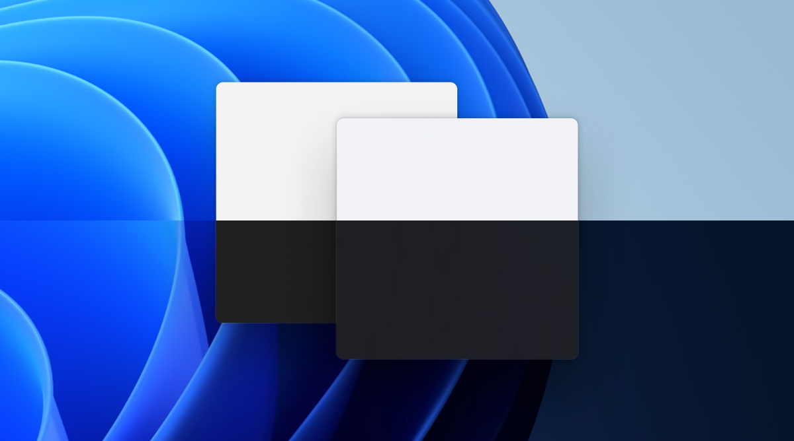
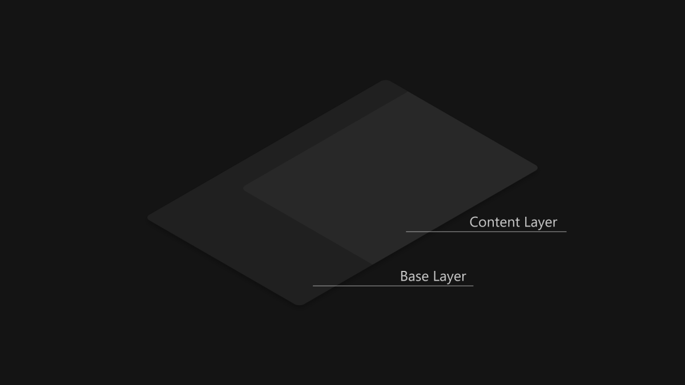
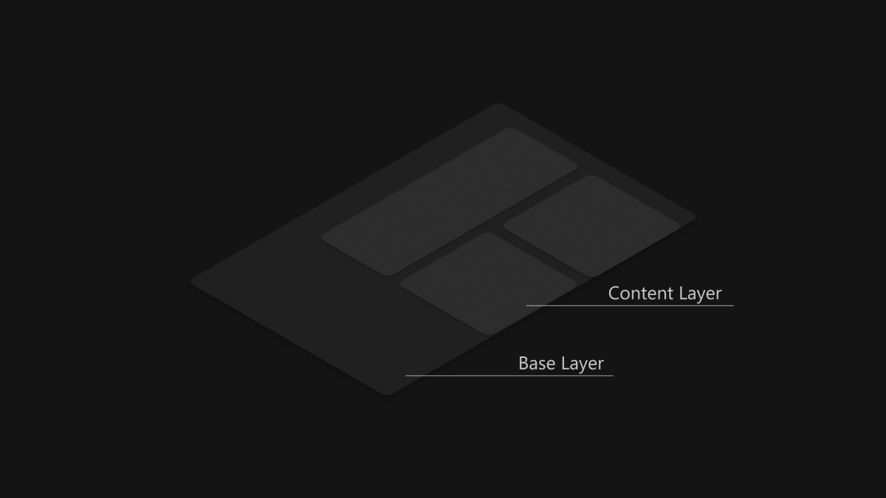
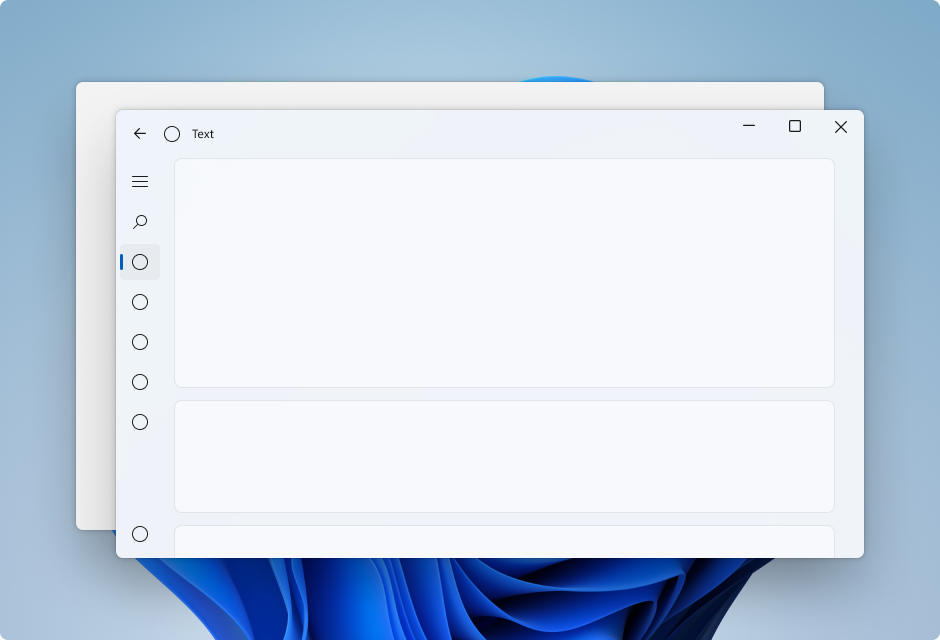

# Mica material

Mica is an opaque, dynamic material that incorporates theme and desktop wallpaper to paint the background of long-lived windows such as apps and settings. You can apply Mica to your application backdrop to delight users and create visual hierarchy, aiding productivity, by increasing clarity about which window is in focus. Mica is specifically designed for app performance as it only samples the desktop wallpaper once to create its visualization.



> **Important APIs**: [BackdropMaterial class](/uwp/api/microsoft.ui.xaml.controls.backdropmaterial)

:::row:::
    :::column:::
Mica in light theme</br>

    :::column-end:::
    :::column:::
Mica in dark theme</br>

    :::column-end:::
:::row-end:::

## Examples

:::row:::
    :::column span:::
    
    :::column-end:::
    :::column span="2":::
**XAML Controls Gallery**<br>
If you have the XAML Controls Gallery app installed, click <a href="xamlcontrolsgallery:/item/Mica">here</a> to open the app and see Mica in action as the backdrop material.

    <a href="https://www.microsoft.com/store/productId/9MSVH128X2ZT">Get the XAML Controls Gallery app (Microsoft Store)</a><br>
    <a href="https://github.com/Microsoft/Xaml-Controls-Gallery">Get the source code (GitHub)</a>
    :::column-end:::
:::row-end:::

## When to use Mica

Mica is a material that appears on the backdrop of your application — behind all other content. It is an opaque material that incorporates the user's theme and desktop wallpaper to create its highly personalized appearance. As the user moves the window across the screen, the Mica material dynamically adapts to create a rich visualization using the wallpaper underneath the application. In addition, the material helps users focus on the current task by falling back to a neutral color when the app is inactive.

We recommend you use and apply Mica as the base layer of your app, prioritizing application and visibility in the title bar area. For more specific layering guidance see [Layering and Elevation](../signature-experiences/layering.md) and [App layering with Mica](#app-layering-with-mica).

## Usability and adaptability

Mica automatically adapts its appearance for a wide variety of devices and contexts. Mica is designed for performance as it only captures the background wallpaper once to create its visualization.

In High Contrast mode, users continue to see the familiar background color of their choosing in place of Mica. In addition, Mica will appear as a solid fallback color (SolidBackgroundFillColorBase):

* When the user turns off transparency in Settings > Personalization > Color.
* When Battery Saver mode is activated.
* When the app runs on low-end hardware.
* When an app window on desktop deactivates.
* When the Windows app is running on Xbox or HoloLens.
* When the Windows version is below 22000.

## How to use Mica

Mica can be applied with the BackdropMaterial class. We recommend that you set the BackdropMaterial attached property on a XAML element that is the root of your XAML content, as it will apply to the entire content region (such as a Window). If your app has a Frame that navigates multiple pages, you should set this property on the Frame. Otherwise, you should set this property on the Page of your app.

```xaml
<Page muxc:BackdropMaterial.ApplyToRootOrPageBackground="True">
    <TextBlock>Hello world</TextBlock>
</Page>
```

## App layering with Mica

:::row:::
    :::column:::
Standard pattern content layer<br/>

    :::column-end:::
    :::column:::
Card pattern content layer<br/>

    :::column-end:::
:::row-end:::

Mica is ideal as a foundation layer in your app's hierarchy due to its inactive and active states and subtle personalization. To follow the two-layer [Layering and Elevation](../signature-experiences/layering.md) system we encourage you to apply Mica as the base layer of your app and add an additional content layer that sits on top of the base layer. The content layer should pick up the material behind it, Mica, using the LayerFillColorDefaultBrush, a low-opacity solid color, as its background. Our recommended content layer patterns are:

* Standard pattern: A contiguous background for large areas that need a distinct hierarchial differentiation from the base layer. The LayerFillColorDefaultBrush should be applied to the container backgrounds of your WinUI app surfaces (e.g. Grids, StackPanels, Frames, etc.).
* Card pattern: Segmented cards for apps that are designed with multiple sectioned and discontinuous UI components. For the definition of the card UI using the LayerFillColorDefaultBrush, see [Layering and Elevation](../signature-experiences/layering.md) guidance.

To give your app's window a seamless look, Mica should be visible in the title bar if you choose to apply the material to your app. You can show Mica in the title bar by extending your app into the non-client area and creating a transparent custom title bar. The below examples showcase common implementations of the layering strategy with [NavigationView](../controls/navigationview.md) where Mica is visible in the title bar area. Each of these examples use and require the same [title bar code-behind](#title-bar-code-behind):

* Standard pattern in Left NavigationView.
* Standard pattern in Top NavigationView.
* Card pattern in Left NavigationView.

### Standard pattern in Left NavigationView

By default, NavigationView in Left mode includes the content layer in its content area. This example extends Mica into the title bar area and creates a custom title bar.


```xaml
<Page
    x:Class="LeftNavView.MainPage"
    xmlns="http://schemas.microsoft.com/winfx/2006/xaml/presentation"
    xmlns:x="http://schemas.microsoft.com/winfx/2006/xaml"
    xmlns:local="using:LeftNavView"
    xmlns:d="http://schemas.microsoft.com/expression/blend/2008"
    xmlns:mc="http://schemas.openxmlformats.org/markup-compatibility/2006"
    xmlns:muxc="using:Microsoft.UI.Xaml.Controls"
    mc:Ignorable="d"
    muxc:BackdropMaterial.ApplyToRootOrPageBackground="True">
    <Page.Resources>
        <!--This top margin is the height of the custom TitleBar-->
        <Thickness x:Key="NavigationViewContentMargin">0,48,0,0</Thickness>
    </Page.Resources>
    <Grid>
        <Border x:Name="AppTitleBar"
                IsHitTestVisible="True"
                VerticalAlignment="Top"
                Background="Transparent"
                Height="40"
                Canvas.ZIndex="1" 
                Margin="48,8,0,0">
            <StackPanel Orientation="Horizontal">
                <Image x:Name="AppFontIcon"
                    HorizontalAlignment="Left" 
                    VerticalAlignment="Center"
                    Source="Assets/Square44x44Logo.png" 
                    Width="16" 
                    Height="16"/>
                <TextBlock x:Name="AppTitle"
                    Text="Test App Title"
                    VerticalAlignment="Center"
                    Margin="12, 0, 0, 0"
                    Style="{StaticResource CaptionTextBlockStyle}" />
            </StackPanel>
        </Border>
        <muxc:NavigationView x:Name="NavigationViewControl"
            IsTitleBarAutoPaddingEnabled="False"            
            IsBackButtonVisible="Visible"           
            Header="Title" 
            DisplayModeChanged="NavigationViewControl_DisplayModeChanged"
            Canvas.ZIndex="0">
            <muxc:NavigationView.MenuItems>
                <muxc:NavigationViewItem Icon="Target" Content="Text"/>
                <muxc:NavigationViewItem Icon="Target" Content="Text"/>
                <muxc:NavigationViewItem Icon="Target" Content="Text"/>
                <muxc:NavigationViewItem Icon="Target" Content="Text"/>
                <muxc:NavigationViewItem Icon="Target" Content="Text"/>
            </muxc:NavigationView.MenuItems>
            <Grid>
                <Frame x:Name="contentFrame">
                    <Grid>
                        <TextBlock Padding="56,16,0,0">Page content!</TextBlock>
                    </Grid>
                </Frame>
            </Grid>
        </muxc:NavigationView>
    </Grid>
</Page>
```

### Standard pattern in Top NavigationView

By default, NavigationView in Top mode includes the content layer in its content area. This example extends Mica into the title bar area and creates a custom title bar.


```xaml
<Page
    x:Class="TopNavView.MainPage"
    xmlns="http://schemas.microsoft.com/winfx/2006/xaml/presentation"
    xmlns:x="http://schemas.microsoft.com/winfx/2006/xaml"
    xmlns:local="using:TopNavView"
    xmlns:d="http://schemas.microsoft.com/expression/blend/2008"
    xmlns:mc="http://schemas.openxmlformats.org/markup-compatibility/2006"
    xmlns:muxc="using:Microsoft.UI.Xaml.Controls"
    mc:Ignorable="d"
    muxc:BackdropMaterial.ApplyToRootOrPageBackground="True">
    <Page.Resources>
        <CornerRadius x:Key="NavigationViewContentGridCornerRadius">0</CornerRadius>
    </Page.Resources>
    <Grid>
        <Border x:Name="AppTitleBar"
                IsHitTestVisible="True"
                VerticalAlignment="Top"
                Background="Transparent"
                Height="32"
                Margin="48,0,0,0">
            <StackPanel Orientation="Horizontal">
                <Image x:Name="AppFontIcon"
                    HorizontalAlignment="Left" 
                    VerticalAlignment="Center"
                    Source="Assets/Square44x44Logo.png" 
                    Width="16" 
                    Height="16"/>
                <TextBlock x:Name="AppTitle"
                    Text="Test App Title"
                    VerticalAlignment="Center"
                    Margin="12,0,0,0"
                    Style="{StaticResource CaptionTextBlockStyle}" />
            </StackPanel>
        </Border>
            <muxc:NavigationView x:Name="NavigationViewControl"          
            Header="Page Title" 
            DisplayModeChanged="NavigationViewControl_DisplayModeChanged"
            PaneDisplayMode="Top">
                <muxc:NavigationView.MenuItems>
                    <muxc:NavigationViewItem Content="Text"/>
                    <muxc:NavigationViewItem Content="Text"/>
                    <muxc:NavigationViewItem Content="Text"/>
                    <muxc:NavigationViewItem Content="Text"/>
                    <muxc:NavigationViewItem Content="Text"/>
            </muxc:NavigationView.MenuItems>
                <Grid>
                    <Frame x:Name="contentFrame">
                        <Grid>
                            <TextBlock Padding="56,16,0,0">Page content!</TextBlock>
                        </Grid>
                    </Frame>
                </Grid>
            </muxc:NavigationView>
    </Grid>
</Page>
```

### Card pattern in Left NavigationView



To follow the card pattern using a NavigationView you will need to remove the default content layer by overriding the background and border theme resources. Then, you can create the cards in the content area of the control. This example creates several cards, extends Mica into the title bar area, and creates a custom title bar. For more information on card UI, see [Layering and Elevation](../signature-experiences/layering.md) guidance.

```xaml
<Page
    x:Class="CardLayout.MainPage"
    xmlns="http://schemas.microsoft.com/winfx/2006/xaml/presentation"
    xmlns:x="http://schemas.microsoft.com/winfx/2006/xaml"
    xmlns:local="using:CardLayout"
    xmlns:d="http://schemas.microsoft.com/expression/blend/2008"
    xmlns:mc="http://schemas.openxmlformats.org/markup-compatibility/2006"
    xmlns:muxc="using:Microsoft.UI.Xaml.Controls"
    mc:Ignorable="d"
    muxc:BackdropMaterial.ApplyToRootOrPageBackground="True">
    <Page.Resources>
        <!--This top margin is the height of the custom TitleBar-->
        <Thickness x:Key="NavigationViewContentMargin">0,48,0,0</Thickness>
        <Thickness x:Key="NavigationViewContentGridBorderThickness">0</Thickness>
        <SolidColorBrush x:Key="NavigationViewContentBackground" Color="Transparent"></SolidColorBrush>
    </Page.Resources>

    <Grid>
        <Border x:Name="AppTitleBar"
                IsHitTestVisible="True"
                VerticalAlignment="Top"
                Background="Transparent"
                Height="40"
                Canvas.ZIndex="1" 
                Margin="48,8,0,0">
            <StackPanel Orientation="Horizontal">
                <Image x:Name="AppFontIcon"
                    HorizontalAlignment="Left" 
                    VerticalAlignment="Center"
                    Source="Assets/Square44x44Logo.png" 
                    Width="16" 
                    Height="16"/>
                <TextBlock x:Name="AppTitle"
                    Text="Test App Title"
                    VerticalAlignment="Center"
                    Margin="12,0,0,0"
                    Style="{StaticResource CaptionTextBlockStyle}" />
            </StackPanel>
        </Border>

        <muxc:NavigationView x:Name="NavigationViewControl"
            IsTitleBarAutoPaddingEnabled="False"            
            IsBackButtonVisible="Visible"           
            Header="Title" 
            DisplayModeChanged="NavigationViewControl_DisplayModeChanged"
            Canvas.ZIndex="0">
            <muxc:NavigationView.MenuItems>
                <muxc:NavigationViewItem Icon="Target" Content="Text"/>
                <muxc:NavigationViewItem Icon="Target" Content="Text"/>
                <muxc:NavigationViewItem Icon="Target" Content="Text"/>
                <muxc:NavigationViewItem Icon="Target" Content="Text"/>
                <muxc:NavigationViewItem Icon="Target" Content="Text"/>
            </muxc:NavigationView.MenuItems>
            <Grid>
                <Frame x:Name="contentFrame">
                    <StackPanel Orientation="Vertical" Margin="40,16,0,0">
                        <Border Width="600" Height="200" Background="{ThemeResource LayerFillColorDefaultBrush}"
                                VerticalAlignment="Top" 
                                HorizontalAlignment="Left" 
                                Margin="16"
                                CornerRadius="8"
                                BorderThickness="1"
                                BorderBrush="{ThemeResource CardStrokeColorDefaultBrush}">
                            <TextBlock VerticalAlignment="Center" HorizontalAlignment="Center">Content here!</TextBlock>
                        </Border>
                        <Border Width="600" Height="200" Background="{ThemeResource LayerFillColorDefaultBrush}"
                                VerticalAlignment="Top" 
                                HorizontalAlignment="Left" 
                                Margin="16" 
                                CornerRadius="8"
                                BorderThickness="1"
                                BorderBrush="{ThemeResource CardStrokeColorDefaultBrush}">
                            <TextBlock VerticalAlignment="Center" HorizontalAlignment="Center">Content here!</TextBlock>
                        </Border>
                        <Border Width="600" Height="200" Background="{ThemeResource LayerFillColorDefaultBrush}"
                                VerticalAlignment="Top" 
                                HorizontalAlignment="Left" 
                                Margin="16"
                                CornerRadius="8"
                                BorderThickness="1"
                                BorderBrush="{ThemeResource CardStrokeColorDefaultBrush}">
                            <TextBlock VerticalAlignment="Center" HorizontalAlignment="Center">Content here!</TextBlock>
                        </Border>
                    </StackPanel>
                </Frame>
            </Grid>
        </muxc:NavigationView>
    </Grid>
</Page>
```

### Title bar code-behind

The previous three app layout XAML pages use the below code-behind to create a custom title bar adaptive to app state and visibility.

For more information see [Title bar customization](../shell/title-bar.md).

```csharp
public MainPage()
{
    this.InitializeComponent();
    var titleBar = ApplicationView.GetForCurrentView().TitleBar;

    titleBar.ButtonBackgroundColor = Colors.Transparent;
    titleBar.ButtonInactiveBackgroundColor = Colors.Transparent;

    // Hide default title bar.
    var coreTitleBar = CoreApplication.GetCurrentView().TitleBar;
    coreTitleBar.ExtendViewIntoTitleBar = true;
    UpdateTitleBarLayout(coreTitleBar);

    // Set XAML element as a draggable region.
    Window.Current.SetTitleBar(AppTitleBar);

    // Register a handler for when the size of the overlaid caption control changes.
    // For example, when the app moves to a screen with a different DPI.
    coreTitleBar.LayoutMetricsChanged += CoreTitleBar_LayoutMetricsChanged;

    // Register a handler for when the title bar visibility changes.
    // For example, when the title bar is invoked in full screen mode.
    coreTitleBar.IsVisibleChanged += CoreTitleBar_IsVisibleChanged;

    //Register a handler for when the window changes focus
    Window.Current.Activated += Current_Activated;
}

private void CoreTitleBar_LayoutMetricsChanged(CoreApplicationViewTitleBar sender, object args)
{
    UpdateTitleBarLayout(sender);
}

private void UpdateTitleBarLayout(CoreApplicationViewTitleBar coreTitleBar)
{
    // Update title bar control size as needed to account for system size changes.
    AppTitleBar.Height = coreTitleBar.Height;

    // Ensure the custom title bar does not overlap window caption controls
    Thickness currMargin = AppTitleBar.Margin;
    AppTitleBar.Margin = new Thickness(currMargin.Left, currMargin.Top, coreTitleBar.SystemOverlayRightInset, currMargin.Bottom);
}

private void CoreTitleBar_IsVisibleChanged(CoreApplicationViewTitleBar sender, object args)
{
    if (sender.IsVisible)
    {
        AppTitleBar.Visibility = Visibility.Visible;
    }
    else
    {
        AppTitleBar.Visibility = Visibility.Collapsed;
    }
}

// Update the TitleBar based on the inactive/active state of the app
private void Current_Activated(object sender, Windows.UI.Core.WindowActivatedEventArgs e)
{
    SolidColorBrush defaultForegroundBrush = (SolidColorBrush)Application.Current.Resources["TextFillColorPrimaryBrush"];
    SolidColorBrush inactiveForegroundBrush = (SolidColorBrush)Application.Current.Resources["TextFillColorDisabledBrush"];

    if (e.WindowActivationState == Windows.UI.Core.CoreWindowActivationState.Deactivated)
    {
        AppTitle.Foreground = inactiveForegroundBrush;
    }
    else
    {
        AppTitle.Foreground = defaultForegroundBrush;
    }
}

// Update the TitleBar content layout depending on NavigationView DisplayMode
private void NavigationViewControl_DisplayModeChanged(Microsoft.UI.Xaml.Controls.NavigationView sender, Microsoft.UI.Xaml.Controls.NavigationViewDisplayModeChangedEventArgs args)
{
    const int topIndent = 16;
    const int expandedIndent = 48;
    int minimalIndent = 104;

    // If the back button is not visible, reduce the TitleBar content indent.
    if (NavigationViewControl.IsBackButtonVisible.Equals(Microsoft.UI.Xaml.Controls.NavigationViewBackButtonVisible.Collapsed))
    {
        minimalIndent = 48;
    }

    Thickness currMargin = AppTitleBar.Margin;
    
    // Set the TitleBar margin dependent on NavigationView display mode
    if (sender.PaneDisplayMode == Microsoft.UI.Xaml.Controls.NavigationViewPaneDisplayMode.Top)
    {
        AppTitleBar.Margin = new Thickness(topIndent, currMargin.Top, currMargin.Right, currMargin.Bottom);
    }
    else if (sender.DisplayMode == Microsoft.UI.Xaml.Controls.NavigationViewDisplayMode.Minimal)
    {
        AppTitleBar.Margin = new Thickness(minimalIndent, currMargin.Top, currMargin.Right, currMargin.Bottom);
    }          
    else
    {
        AppTitleBar.Margin = new Thickness(expandedIndent, currMargin.Top, currMargin.Right, currMargin.Bottom);
    }
}
```

## Do's and don'ts

* **Do** apply BackdropMaterial to the back-most layer replacing the ApplicationPageBackgroundThemeBrush.
* **Do** set all background layers that you want to see Mica in to *transparent* so the Mica shows through.  
* **Don't** apply BackdropMaterial more than once in an application.
* **Don't** apply BackdropMaterial to a UI element. The backdrop material will not appear on the element itself. It will only appear if all layers between the UI element and the window are set to transparent.

## Get the sample code

- [XAML Controls Gallery sample](https://github.com/Microsoft/Xaml-Controls-Gallery) - See all the XAML controls in an interactive format.

## Related articles

[BackdropMaterial class](/uwp/api/microsoft.ui.xaml.controls.backdropmaterial), [NavigationView](../controls/navigationview.md), [Materials](../signature-experiences/materials.md), [Layering and Elevation](../signature-experiences/layering.md)