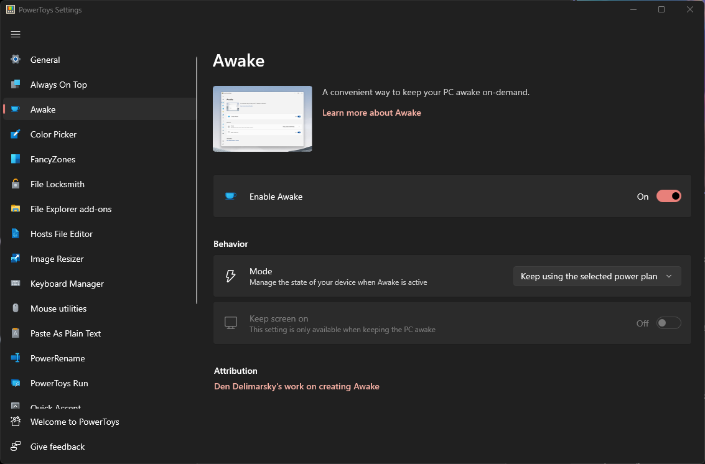

# Awake utility

Awake is a utility tool for Windows designed to keep a computer awake without having to manage its [power & sleep settings](https://support.microsoft.com/windows/how-to-adjust-power-and-sleep-settings-26f623b5-4fcc-4194-863d-b824e5ea7679). This behavior can be helpful when running time-consuming tasks, ensuring that the computer does not go to sleep or turn off its screens.

## Get started

Awake can be used directly from PowerToys settings or as a standalone executable. When the tool is running from PowerToys, it can be managed from PowerToys settings or the system tray.

> [!NOTE]
> Awake does not modify any of the Windows power plan settings, and does not depend on a custom power plan configuration. Instead, it spawns background threads that tell Windows that they require a specific state of the machine.

## PowerToys settings

In the PowerToys settings view, start Awake by using the **Enable Awake** toggle. Once enabled, the application will manage the awakeness state of the computer.

The following Awake states can be selected:

- **Off (Passive)** - The computer awakeness state is unaffected. The application is waiting for user input.
- **Keep awake indefinitely** - The computer stays awake indefinitely, until the user explicitly puts the machine to sleep or exits/disables the application.
- **Keep awake temporarily** - Keep machine awake for a pre-defined limited time. Once the time elapses, computer resumes its previous awakeness state.

> [!NOTE]
> Changing the hours or minutes while the computer is kept awake temporarily will reset the timer.

## Keep screen on

While Awake can keep the computer awake indefinitely or temporarily, in its default state the displays connected to the machine will turn off, even though the computer won't go to sleep. If you need the displays to be available, use the **Keep screen on** switch, which will ensure that all monitors remain on.

## System tray

To manage the execution of the tool from the system tray, right-click on the Awake icon.

## Command Line Interface (CLI)

Awake can also be executed as a standalone application, directly from the PowerToys folder. The following command line arguments can be used when running `PowerToys.Awake.exe` from the terminal:

| Argument          | Description |
|:------------------|:------------|
| `--use-pt-config` | Use the PowerToys configuration file to manage the settings. This assumes that there is a `settings.json` file for Awake, generated by PowerToys, that contains all required runtime information. This includes the Behavior Mode (indefinite or timed), whether screens should be kept on, and what the values for hours and minutes are for a temporary keep-awake. When this argument is used, all other arguments are ignored. Awake will look for changes in the `settings.json` file to update its state. |
| `--display-on`    | Determines whether the screens should be kept on or off while the machine is kept awake. Expected values are `true` or `false`. |
| `--time-limit`    | Duration, in seconds, during which Awake keeps the computer awake. Can be used in combination with `--display-on`. |
| `--pid`           | Attaches the execution of Awake to a Process ID (PID). When the process with a given PID terminates, Awake terminates as well. |

In absence of command-line arguments, Awake will keep the computer awake indefinitely.
