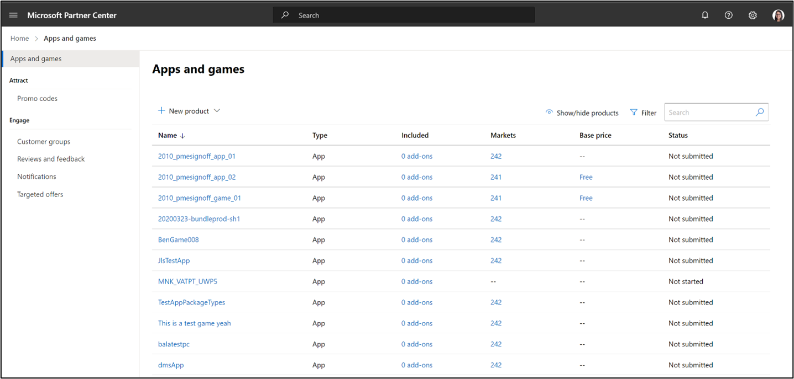
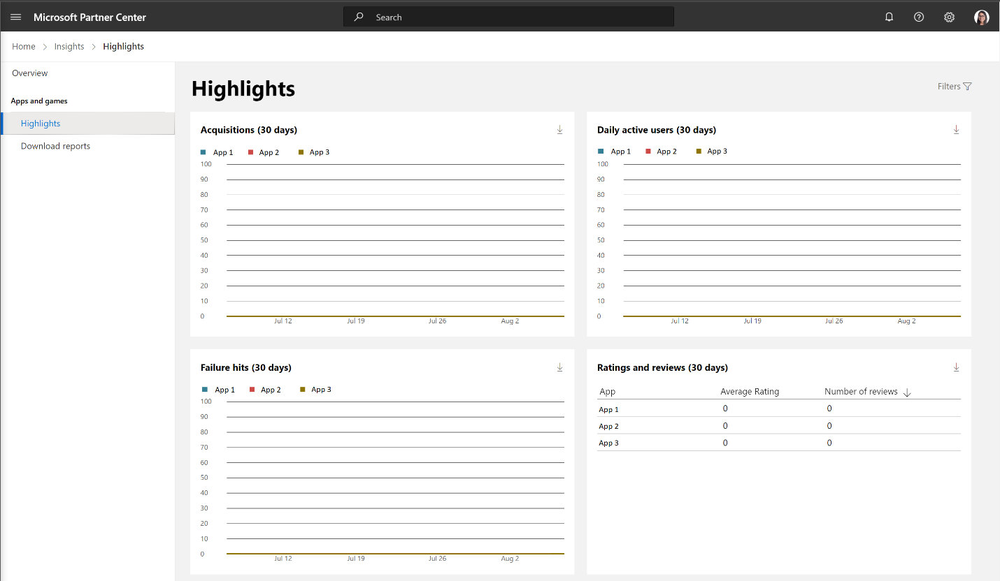
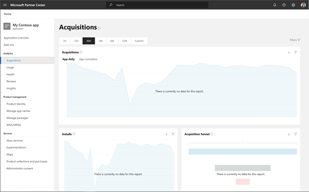

# Partner Center Workspaces

Partner Center is the central place for partners to manage their relationship with Microsoft. As part of our commitment to make it easier to do business with Microsoft, we’re updating the user experience. These changes bring consistency across Partner Center and related Microsoft portals and will help partners have a more efficient and productive experience as they complete tasks. As part of the changes, we’ll define clear user roles, institute consistent and inclusive design principles, and organize where users complete their tasks into **workspaces**. We’ll launch with the initial experience and continue to release improvements throughout the year.

## What does the transition to the new Partner Center user experience mean for me?

We’ve reorganized where you can complete tasks into workspaces, with no loss of capabilities. You can continue doing business in the new Partner Center user experience, in the respective workspaces below.

| Workspace            | Tasks |
|----------------------|-------|
| **Account settings** | View and edit your account settings, including your company profile, bank information, users, and permissions |
| **Insights**         | View data on your customers and their purchases, and gain insights on how to grow your business. |
| **Apps and games**   | Create, publish, and manage products for the Windows and Xbox Store. |
| **Payouts**          | Set up your payout account, and view and manage payout statements. |
| **Support**          | Get service health updates, view support articles, contact support, schedule support appointments, and manage your support requests. |

### Will these changes impact APIs?

No, these user experience changes will not impact APIs.

### Will there be any loss of workflows/capabilities?

No, there will be workflow parity between the old and new user experience.

### Will the links for pages change?

Yes, some links will change but redirects will be in place to ensure a seamless experience. If you want to update your bookmarks, here is the list of link changes.

| Page | Legacy page link | Workspace page link |
|------|------------------|---------------------|
Windows & Xbox Overview page | `https://partner.microsoft.com/en-us/dashboard/windows/overview` | `https://partner.microsoft.com/en-us/dashboard/apps-and-games` |

### Where do I find documentation for the new user experience?

The Microsoft Documentation at Publish Windows apps and games | Microsoft Docs is updated to reflect the new experience. You can read about the changes in navigation for critical tasks such as creating and accessing products in the next section.

## Create a new product in the new Apps and games workspace

1. Sign in to Partner Center.
2. Select the Apps and games workspace from the Home page or from the left-navigation menu.
    
3. On the Apps and games workspace, select + New product, and then select the type of product from the list.   
    
4. Further instructions on creating and publishing specific product types are available in the Microsoft Documentation site here: Publish Windows apps and games | Microsoft Docs

## Access an existing product in the new Apps and games workspace

1. Sign in to Partner Center.
1. Select the Apps and games workspace from the Home page or from the left-navigation menu.
    
1. On the Apps and games workspace, use the search and filter features to find the product you want.
    
1. Further instructions on publishing updates to specific product types are available in the Microsoft Documentation site here: Publish Windows apps and games | Microsoft Docs

## Navigating back to the Apps and games workspace

Use the new site breadcrumb to navigate to the Apps and games workspace from within any of the product pages. You can select any part of the breadcrumb to quickly go to the page you want.

## Access Engage and Attract features in the new Apps and Games workspace

1. Sign in to Partner Center.
1. Select the Apps and games workspace from the Home page or from the left-navigation menu.
1. On the Apps and games workspace, select the Engage and Attract features you want from the left navigation.
    - Create promotions
    - Create customer groups
    - View your product’s reviews and feedback
    - Send push notifications
    - Create targeted offers

    

## Access analytics reports in the new Partner Center experience

1. Sign in to Partner Center.
1. Select the Insights workspace from the Home page or from the left-navigation menu.

    
1. View the Highlights report or download reports from the left navigation of the workspace.
    > [!NOTE]
    > If you are looking for product specific analytic reports, those are still accessible from within the product pages.

    

1. Navigate to Apps and games, select the product, access Analytics reports from the left navigation.
    

## Access payout reports in the new Partner Center experience

- Sign in to Partner Center.
- Select the Payouts workspace from the Home page or from the left-navigation menu.

## Access support in the new Partner Center experience

- Sign in to Partner Center.
- Select the Help + Support workspace from the Home page or from the left-navigation menu.
