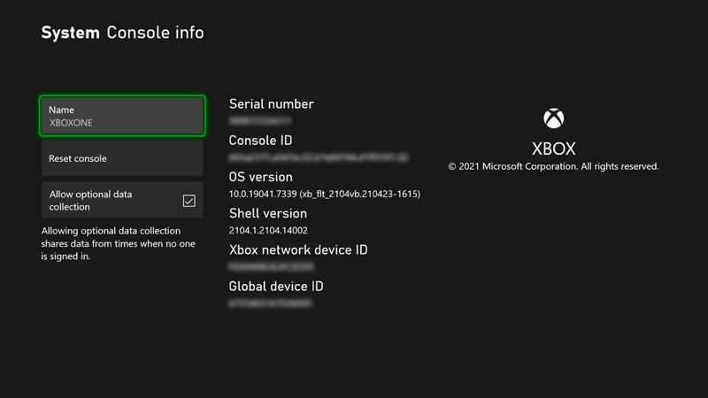
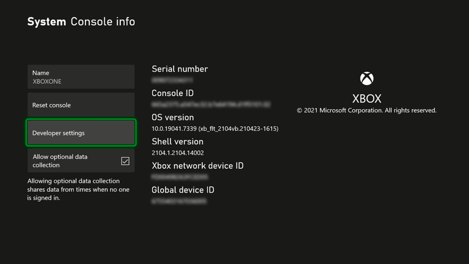
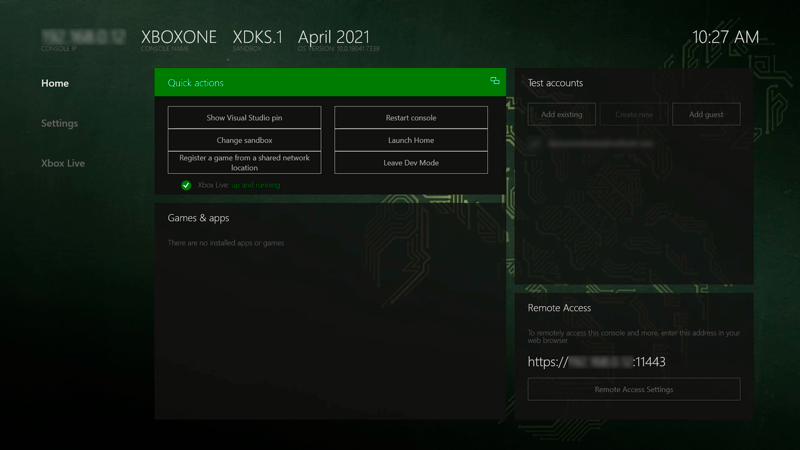
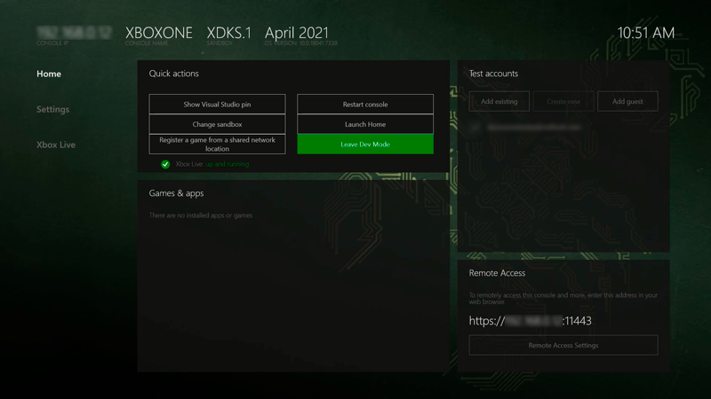

# Xbox Developer Mode activation

## How Developer Mode works
This article only applies to Xbox One and Xbox Series X|S consoles acquired through retail channels. For development kit HW acquired via a managed development program, see the note down below.

Xbox retail consoles can have two modes, Retail Mode (1) and Developer Mode (2). In Retail Mode, the console is in its normal state: you can play games and run apps acquired through the Xbox store. In Developer Mode, you can develop and test software for the console, but you cannot play retail games or run retail apps.

Developer Mode can be enabled on any retail Xbox console, via the **Settings** > **System** > **Console info** menu. After Developer Mode is enabled on your retail console, you can switch back and forth between Retail (2a) and Developer Mode (2b).

> [!NOTE]
> Do not perform the following steps on any Xbox development hardware acquired through an Xbox managed program (for example, ID@Xbox) or you may introduce errors and delays while developing your game. If you're a managed partner, you can get more information on activating development hardware. Go to https://developer.microsoft.com/en-us/games/xbox/docs/gdk/provisioning-role.

  

## Activate Developer Mode on your retail Xbox console

1.	Start your Xbox console.

2.	Make sure your console have the latest Xbox system update installed. For more information, please visit [About system updates on Xbox Series X|S and Xbox One](https://support.xbox.com/en-us/help/hardware-network/settings-updates/system-update-overview)

3.	Go to **Settings** > **System** > **Console info**.

    

4.	On your controller, press **LB**, **RB**, **LT**, **RT**. The Developer settings menu entry will be shown.

    

5.	Go to **Developer settings** > Check **Developer mode** and choose **Continue**. Your Xbox console will restart.

    
    
6.	After restarting, your Xbox will be in Developer Mode.

    

## Switch back to Retail Mode
After Developer Mode has been enabled on your console, to switch back to Retail Mode, under **Quick actions**, select **Leave Dev Mode**. This will restart your console in Retail Mode.    

  
  
## See also
- [UWP on Xbox One](index.md)
